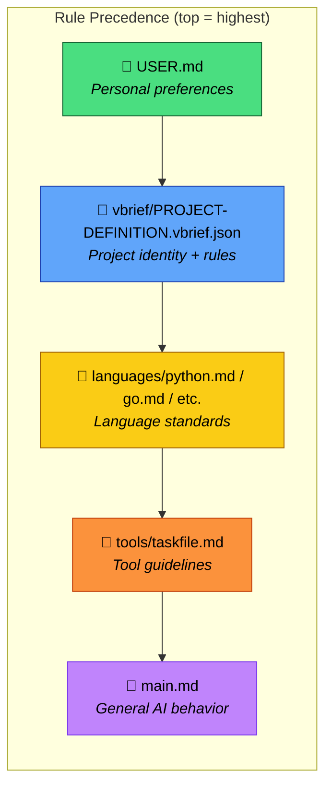
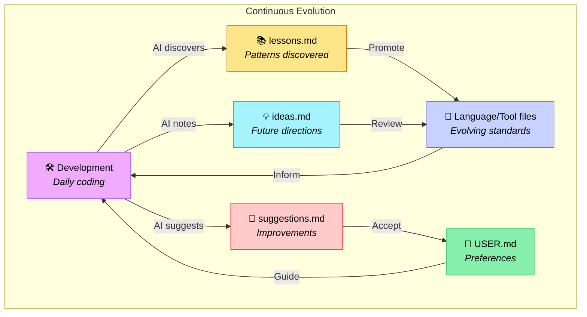

# Deft Architecture

How Deft layers fit together, how rules cascade, and how project requirements (specs / scope vBRIEFs) are kept distinct from the rule hierarchy.

> **📚 See also**: [CONCEPTS.md](./CONCEPTS.md) (key principles) • [FILES.md](./FILES.md) (directory tree + file index) • [RELEASING.md](./RELEASING.md) • [../README.md](../README.md) (TL;DR + Getting Started)

## 🎯 What is Deft?

Deft is a structured approach to working with AI coding assistants that provides:

- **Consistent coding standards** across languages and projects
- **Reproducible workflows** via task-based automation
- **Self-improving guidelines** that evolve with your team
- **Hierarchical rule precedence** from general to project-specific
- **Lazy loading** — agents only read files relevant to the current task (see [REFERENCES.md](../REFERENCES.md))

**Two AI-agent entry surfaces:**

- **`AGENTS.md`** is the canonical entry point inside this repository (and the file the installer wires into your project). It uses repo-relative paths.
- **`SKILL.md`** is the alternate entry surface for platforms / loaders that prefer the `SKILL.md` convention. Both surfaces ultimately point at `main.md` for general AI behavior.

If you're on a platform that doesn't yet support `SKILL.md`, just add a line to your `AGENTS.md` that says `See deft/main.md` (the installer does this for you).

## 🎸 From Vibe to Virtuoso

**AGENTS.md** alone is great for vibe-coding — loose guidance, good enough for quick work:

> "Make it clean, I like tests, use TypeScript."

**Deft** is for when you want virtuoso results: precise standards, reproducible workflows, and AI that improves over time.

| Vibe (AGENTS.md alone) | Virtuoso (Deft) |
|------------------------|-----------------|
| All rules in one file | Modular — load only what's relevant |
| Gets bloated across languages/tools | Scales cleanly (python.md stays focused) |
| Same context loaded every session | Lazy-loading saves tokens |
| Preferences mixed with standards | Clear separation (USER.md vs language files) |
| No evolution mechanism | Meta files capture learnings automatically |
| Starts fresh each project | Portable across projects |

**When to use which:**

- Your AGENTS.md is under 200 lines and you work in one language? Vibe is fine.
- It's growing unwieldy, you're repeating yourself, or you want consistent quality across projects? Deft pays off.

## 📚 The Layers

Deft uses a layered architecture where more specific rules override general ones:



### Rule Hierarchy

Rules cascade with precedence (highest first). This is the **how-the-AI-behaves** ladder:

1. **USER.md** (highest) — your personal overrides (`~/.config/deft/USER.md` on Unix/macOS, `%APPDATA%\deft\USER.md` on Windows)
2. **vbrief/PROJECT-DEFINITION.vbrief.json** — project-specific rules and identity gestalt
3. **Language files** (`languages/python.md`, `languages/go.md`, ...) — language standards
4. **Tool files** (`tools/taskfile.md`, ...) — tool guidelines
5. **main.md** (lowest) — general AI behavior

### Project Requirements (separate from the rule ladder)

Project requirements describe **what to build**, not **how the AI behaves**. They are not part of the rule cascade above:

- **`vbrief/specification.vbrief.json`** — project spec (source of truth) — rendered to `SPECIFICATION.md` via `task spec:render`
- **Scope vBRIEFs** in `vbrief/{proposed,pending,active,completed,cancelled}/` — individual units of work
- **`ROADMAP.md`** — rendered backlog view from `vbrief/pending/` and `vbrief/completed/`

The rule ladder governs the agent. The requirements / scope ladder governs the work. Keeping them distinct prevents the common error of treating the spec as a behavior override.

## 🔄 Continuous Improvement

The deft process evolves over time:



- AI updates `meta/lessons.md` when learning better patterns
- AI notes ideas in `meta/ideas.md` for future consideration
- AI suggests improvements in `meta/suggestions.md`
- You update your USER.md (`~/.config/deft/USER.md` on Unix/macOS, `%APPDATA%\deft\USER.md` on Windows) with new preferences
- You update language/tool files as standards evolve

## 📦 Document Generation & vBRIEF Tooling

Deft provides deterministic `task` commands for rendering, migrating, and validating documents. They are split here by audience.

### Migration (one-time)

| Command | Description |
|---------|-------------|
| `task migrate:vbrief` | Migrate existing projects to vBRIEF lifecycle folder structure (one-time cutover from pre-v0.20 model) |

### Authoring (day-to-day)

| Command | Description | When to use |
|---------|-------------|-------------|
| `task spec:render` | Regenerate `SPECIFICATION.md` from `specification.vbrief.json` | After editing the spec vBRIEF |
| `task prd:render` | Export `plan.narratives` from `specification.vbrief.json` to a read-only `PRD.md` for stakeholder review | On demand for stakeholder PRD-style export |
| `task roadmap:render` | Regenerate `ROADMAP.md` from `vbrief/pending/` + `vbrief/completed/` | After promoting/demoting scopes |
| `task project:render` | Regenerate `vbrief/PROJECT-DEFINITION.vbrief.json` items registry | After scope lifecycle changes |
| `task issue:ingest -- <N>` | Ingest a single GitHub issue as a scope vBRIEF in `vbrief/proposed/` (deduplicates via existing references) | After filing a new issue you plan to work on |
| `task issue:ingest -- --all [--label L] [--status S] [--dry-run]` | Bulk-ingest open issues into scope vBRIEFs | Post-refactor / post-release cleanup, or when reducing the `reconcile` unlinked backlog |

### CI / pre-commit

| Command | Description |
|---------|-------------|
| `task vbrief:validate` | Validate vBRIEF schema, filenames, folder/status consistency (runs as part of `task check`) |
| `task verify:links` | Validate internal markdown links |
| `task verify:stubs` | Scan source files for stub patterns |
| `task verify:rule-ownership` | Verify the Rule Ownership Map is in sync with its owner files |

See [../commands.md](../commands.md) for the full change lifecycle and the [Command Lifecycle: `run` vs `task`](../commands.md#command-lifecycle-run-vs-task) section there for detailed usage.

### Ingesting GitHub issues

Post-v0.20, new GitHub issues become scope vBRIEFs via `task issue:ingest`:

```bash
# Single issue -- writes vbrief/proposed/YYYY-MM-DD-<N>-<slug>.vbrief.json
task issue:ingest -- 123

# Bulk ingest all open issues carrying the `bug` label, dry-run first
task issue:ingest -- --all --label bug --dry-run
task issue:ingest -- --all --label bug
```

The script deduplicates against existing `references[type=x-vbrief/github-issue]` entries in `vbrief/`, writes to the lifecycle folder selected by `--status proposed|pending|active` (default: `proposed`), and exits with `1` if the issue already has a scope vBRIEF. Use `--dry-run` in bulk mode to preview without writing files.

## Command Lifecycle: `run` vs `task`

Deft uses two complementary command surfaces:

- **`run` commands** (`.deft/core/run bootstrap`, `.deft/core/run spec`, `.deft/core/run validate`) handle **interactive creation** — bootstrapping user/project config, conducting spec interviews, validating configuration. These are the entry points for humans starting new work.
- **`task` commands** (`task spec:render`, `task roadmap:render`, `task migrate:vbrief`, etc.) handle **scripted rendering, migration, and validation** — deterministic operations that transform vBRIEF source files into readable artifacts or enforce structural rules.

This split is intentional: `run` commands are conversational and agent-friendly; `task` commands are deterministic and CI-friendly. For the full document lifecycle, start with `run` to create, then use `task` to render and validate. See [../commands.md](../commands.md) for cross-references.
