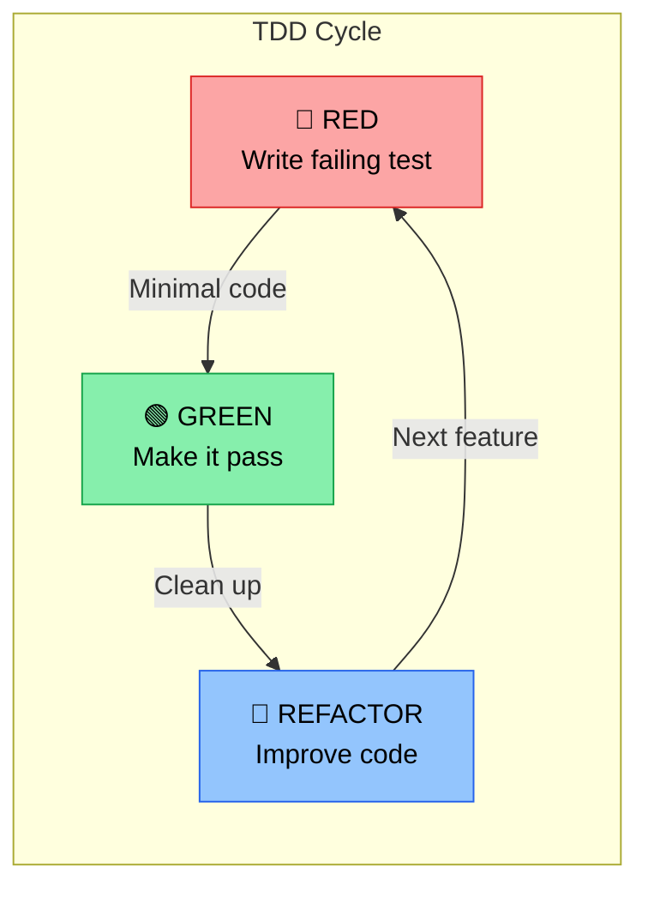
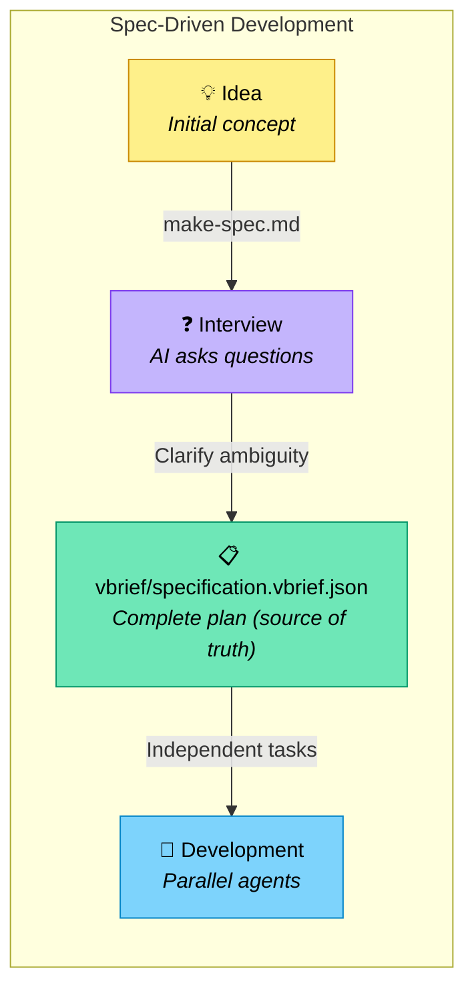
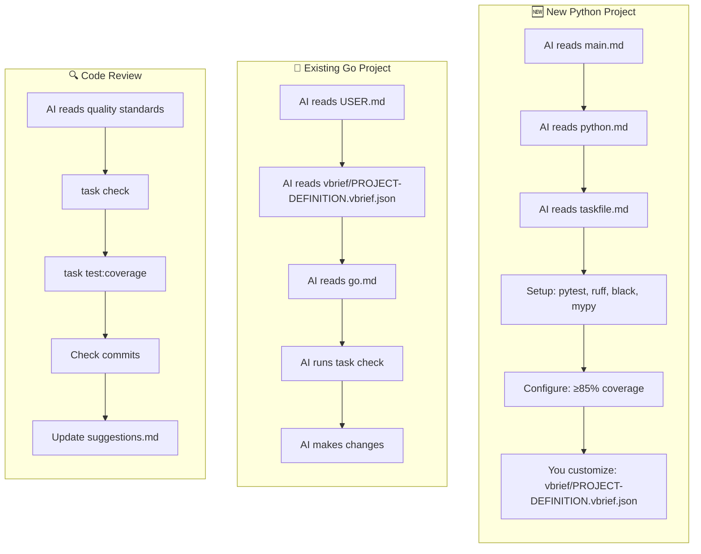
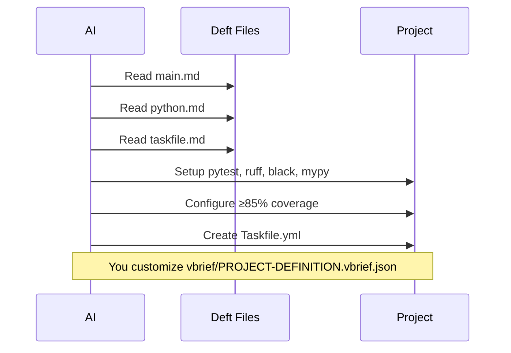
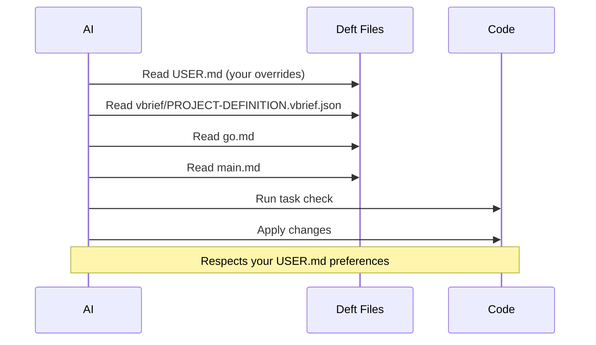
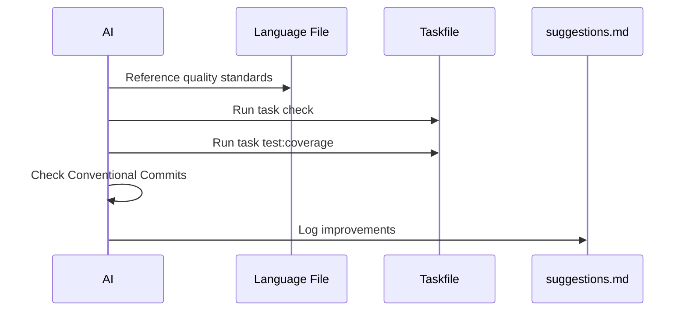

# Deft Key Concepts

Core principles that drive Deft's workflow design: Spec-Driven Development, Test-Driven Development, the Taskfile-centric workflow, Convention-Over-Configuration, and Safety/Reversibility.

> **📚 See also**: [ARCHITECTURE.md](./ARCHITECTURE.md) (layers + rule hierarchy) • [FILES.md](./FILES.md) (directory tree + file index) • [RELEASING.md](./RELEASING.md) • [../README.md](../README.md) (TL;DR + Getting Started)

## 🛠️ Task-Centric Workflow with Taskfile

**Why Taskfile?**

Deft uses [Taskfile](https://taskfile.dev) as the universal task runner for several reasons:

1. **Makefiles are outdated**: Make syntax is arcane, portability is poor, and tabs vs spaces causes constant friction
2. **Polyglot simplicity**: When working across Python (make/invoke/poetry scripts), Go (make/mage), Node (npm scripts/gulp), etc., each ecosystem has different conventions. Taskfile provides one consistent interface
3. **Better than script sprawl**: A `/scripts` directory with dozens of bash files becomes chaotic — hard to discover, hard to document, hard to compose. Taskfile provides discoverability (`task --list`), documentation (`desc`), and composition (`deps`)
4. **Modern features**: Built-in file watching, incremental builds via checksums, proper error handling, variable templating, and cross-platform support

**Usage:**

```bash
task --list        # See available tasks
task check         # Pre-commit checks
task test:coverage # Run coverage
task dev           # Start dev environment
```

## 🧪 Test-Driven Development (TDD)

Deft embraces TDD as the default development approach:



1. **Write the test first**: Define expected behavior before implementation
2. **Watch it fail**: Confirm the test fails for the right reason
3. **Implement**: Write minimal code to make the test pass
4. **Refactor**: Improve code quality while keeping tests green
5. **Repeat**: Build features incrementally with confidence

**Benefits:**

- Tests become specifications of behavior
- Better API design (you use the API before implementing it)
- High coverage naturally (≥85% is easy when tests come first)
- Refactoring confidence
- Living documentation

**In Practice:**

```bash
task test          # Run tests in watch mode during development
task test:coverage # Verify ≥85% coverage
task check         # Pre-commit: all quality checks including tests
```

### Quality First

- ≥85% test coverage (overall + per-module)
- Always run `task check` before commits
- Run linting, formatting, type checking
- Never claim checks passed without running them

## 📐 Spec-Driven Development (SDD)

Before writing any code, deft uses an AI-assisted specification process:



**The Process:**

1. **Start with make-spec.md**: A prompt template for creating specifications

   ```markdown
   I want to build **\_\_\_\_** that has the following features:

   1. Feature A
   2. Feature B
   3. Feature C
   ```

2. **AI Interview**: The AI (Claude or similar) asks focused, non-trivial questions to clarify:
   - Missing decisions and edge cases
   - Implementation details and architecture
   - UX considerations and constraints
   - Dependencies and tradeoffs

   Each question includes numbered options and an "other" choice for custom responses.

3. **Generate a scope vBRIEF** (and optionally `vbrief/specification.vbrief.json` via the Full path): Once ambiguity is minimized, the AI produces a comprehensive vBRIEF with:
   - Clear phases, subphases, and tasks
   - Dependency mappings (what blocks what)
   - Parallel work opportunities
   - No code—just the complete plan

   `.md` exports (`SPECIFICATION.md`, `PRD.md`) are generated views via `task spec:render` / `task prd:render`; the `.vbrief.json` files remain authoritative.

4. **Multi-Agent Development**: The spec enables multiple AI coding agents to work in parallel on independent tasks

**Why SDD?**

- **Clarity before coding**: Catch design issues early
- **Parallelization**: Clear dependencies enable concurrent work
- **Scope management**: Complete spec prevents scope creep
- **Onboarding**: New contributors/agents understand the full picture
- **AI-friendly**: Structured specs help AI agents stay aligned

**Example**: See `templates/make-spec.md` for the interview process template.

## 📏 Convention Over Configuration

- Use Conventional Commits for all commits
- Use hyphens in filenames, not underscores
- Keep secrets in `secrets/` directory
- Keep docs in `docs/`, not project root

## 🛡️ Safety and Reversibility

- Never force-push without permission
- Assume production impact unless stated
- Prefer small, reversible changes
- Call out risks explicitly

## 📖 Example Workflows



### Starting a New Python Project



1. AI reads: `main.md` → `languages/python.md` → `tools/taskfile.md`
2. AI sets up: pytest, ruff, black, mypy, Taskfile
3. AI configures: ≥85% coverage, PEP standards
4. You customize: `vbrief/PROJECT-DEFINITION.vbrief.json` with project specifics

### Working on an Existing Go Project



1. AI reads: `USER.md` → `vbrief/PROJECT-DEFINITION.vbrief.json` → `languages/go.md` → `main.md`
2. AI follows: go.dev/doc/comment, Testify patterns
3. AI runs: `task check` before suggesting changes
4. AI respects: your USER.md overrides

### Code Review Session



1. AI references quality standards from language file
2. AI runs `task check` and `task test:coverage`
3. AI checks Conventional Commits compliance
4. AI suggests improvements → adds to `meta/suggestions.md`

## 📝 Contributing to Deft

As you use deft, AI maintains three meta files that help the framework evolve:

### lessons.md — Patterns discovered during development

```markdown
## 2026-01-15: Testify suite setup
When using Testify in Go, always define `suite.Suite` struct with
dependencies as fields, not package-level vars. Discovered during
auth-service refactor—package vars caused test pollution.

## 2026-01-20: CLI flag defaults
For CLI tools, default to human-readable output, use `--json` flag
for machine output. Users expect pretty by default.
```

### ideas.md — Potential improvements for later

```markdown
- [ ] Native VS Code extension surfacing scope vBRIEFs and `task` runners
      directly in the sidebar
- [ ] Consider `deft/interfaces/grpc.md` for protobuf/gRPC patterns
- [ ] Explore integration with cursor rules format
```

### suggestions.md — Project-specific improvements

```markdown
## auth-service
- The retry logic in `client.go` should use exponential backoff
  (currently linear)—see coding.md resilience patterns

## api-gateway
- Consider splitting routes.go (850 lines) into domain-specific
  route files per coding.md file size guidelines
```

Review these periodically and promote good ideas to main guidelines.
