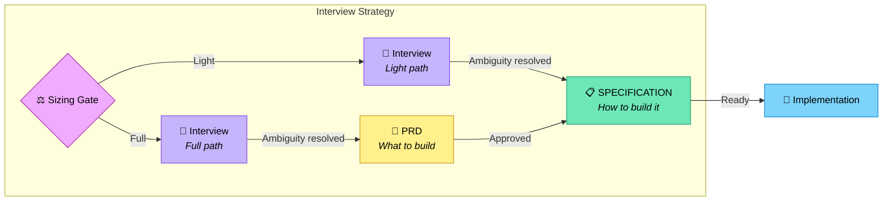

# Interview Strategy

The standard Deft workflow: structured interview → SPECIFICATION. This is the
canonical source of truth for the interview process. All entry points (CLI via
`run spec`, agent via `deft-directive-setup` Phase 3, and `templates/make-spec.md`) MUST
follow this strategy.

Legend (from RFC2119): !=MUST, ~=SHOULD, ≉=SHOULD NOT, ⊗=MUST NOT, ?=MAY.

**⚠️ See also**: [strategies/discuss.md](./discuss.md) | [strategies/yolo.md](./yolo.md) | [core/glossary.md](../core/glossary.md)

## When to Use

- ! Default strategy for all new projects
- ~ Projects with unclear or evolving requirements
- ~ When stakeholder alignment is needed before implementation
- ? Skip to SPECIFICATION phase if requirements are already fully documented

---

## Chaining Gate

Before spec generation, offer the user a chance to run preparatory strategies
or switch to a different spec-generating strategy. This gate is the single
orchestration point for strategy composition.

! The chaining gate MUST always be shown — even when the interview strategy is
invoked directly with no prior strategy.
! The chaining gate is a **blocking question**. The AI MUST present the options
and wait for the user to choose before proceeding.
⊗ Skip the chaining gate or proceed to the sizing gate without presenting it.

### When It Appears

- ! Before the [Sizing Gate](#sizing-gate) on every entry to the interview strategy
- ! After each completed preparatory strategy (recursive — the gate reappears)
- ! After the [Acceptance Gate](#acceptance-gate) when the user chooses "Revise" or "Switch"

### Options

Present two groups sourced from the `Type` column in
[strategies/README.md](./README.md#strategy-types):

**Default:**
1. **Proceed to specification** (default) — continue to the [Sizing Gate](#sizing-gate)

**Preparatory strategies** (type: `preparatory` — loops back to this gate on completion):
- Research — investigate the domain, find libraries, identify pitfalls
- Discuss — lock key decisions using Feynman technique
- Probe — adversarially stress-test the plan; surface assumptions, edge cases, and risks
- Map — analyze existing codebase conventions

~ Some preparatory strategies (currently map) also support standalone invocation
via `/deft:run:<name>` without entering the interview flow. When invoked standalone,
they present their own completion options instead of returning to this gate.
See `strategies/map.md` for standalone behavior.

**Switch spec-generating strategy** (type: `spec-generating` — replaces current pipeline):
- Yolo — auto-pilot, Johnbot picks all answers
- SpecKit — formal spec process with story readiness before implementation

### Run Count Annotations

- ! Previously-run strategies MUST display with a run count (e.g., `Research (ran 1×)`)
- ! No strategy is ever removed from the gate — users can re-run any strategy
- ! Run counts are read from `completedStrategies` in
  [`./vbrief/plan.vbrief.json`](../vbrief/vbrief.md#strategy-chaining-fields)

### State Tracking

- ! On completion of a preparatory strategy, update `completedStrategies` in
  `./vbrief/plan.vbrief.json`: increment `runCount`, append artifact paths
- ! Append all new artifact paths to the flat `artifacts` array
- ! The next strategy and eventual spec generation MUST load all artifacts
  listed in `plan.vbrief.json`

### Example Prompt

```
Ready to generate the specification. Before we proceed, would you like to:

1. Proceed to specification (default)

--- Preparatory (loops back) ---
2. Run a research phase — investigate the domain, find libraries, identify pitfalls
3. Run a discuss phase — lock key decisions using Feynman technique
4. Run a probe phase — adversarially stress-test the plan; surface assumptions, edge cases, and risks
5. Run a map phase — analyze existing codebase conventions

--- Switch strategy ---
6. Switch to yolo — auto-pilot picks all answers
7. Switch to speckit — formal spec process with story readiness before implementation

8. Other (specify)
```

---

## Sizing Gate

Before the interview begins, determine project complexity to select the
appropriate path. The gate runs once, immediately after hearing what the user
wants to build.

! The sizing gate is a **blocking question**. The AI MUST propose a size and
wait for the user to confirm or override before asking any interview questions.
⊗ Combine the sizing proposal with the first interview question in the same message.
⊗ Proceed to interview questions before the user has explicitly confirmed the path.

### Sizing Signals

The AI SHOULD propose a size based on these signals; the user confirms or overrides:

- Number of features (≤5 → Light, >5 → Full)
- Number of components/services (1–2 → Light, 3+ → Full)
- Expected duration (days → Light, weeks/months → Full)
- Team/agent count (solo → Light, multi-agent/swarm → Full)
- Integration complexity (standalone → Light, external APIs/auth/DB → Full)

### PROJECT-DEFINITION.vbrief.json Override

`PROJECT-DEFINITION.vbrief.json` narratives ? declare `"Process": "Light"` or `"Process": "Full"` to skip the
gate entirely. `PROJECT.md` (deprecated) may also carry this field. If the field is absent or empty, the AI MUST ask.

## Workflow Overview



---

## Interview Rules (shared by both paths)

- ~ Use Claude AskInterviewQuestion when available (emulate if not)
- ! Ask **ONE** focused, non-trivial question per step
- ⊗ Ask multiple questions at once or sneak in "also" questions
- ~ Provide numbered answer options when appropriate
- ! Include "other" option for custom/unknown responses
- ! Indicate which option is RECOMMENDED
- ! When making an opinionated recommendation, state the principle (1 sentence)
- ! When done, append all questions asked and answers given to the working document

### Question Areas

- ! Missing decisions (language, framework, deployment)
- ! Edge cases (errors, boundaries, failure modes)
- ! Implementation details (architecture, patterns, libraries)
- ! Requirements (performance, security, scalability)
- ! UX/constraints (users, timeline, compatibility)
- ! Tradeoffs (simplicity vs features, speed vs safety)

### Transition Criteria (interview complete)

- ! All major decisions have answers
- ! Edge cases are addressed
- ! User has approved key tradeoffs (Interview strategy) or Johnbot has chosen recommended options (Yolo strategy)
- ~ Little ambiguity remains

---

## Light Path (small/medium projects)

Interview → scope vBRIEFs (date-prefixed in proposed/) + PROJECT-DEFINITION.vbrief.json + rendered SPECIFICATION (v0.20 contract).

### Flow

1. Sizing gate selects Light
2. Interview (rules above)
3. Write scope vBRIEF(s) to `./vbrief/proposed/YYYY-MM-DD-<slug>.vbrief.json` (date-prefixed per vbrief filename convention) with `status: proposed`
4. Run `task project:render` to create/update `./vbrief/PROJECT-DEFINITION.vbrief.json` (full project identity + items registry) and ensure all five lifecycle folders exist
5. Summarize decisions, ask user to review
6. On approval, use `task scope:promote` (or equivalent) to move scope vBRIEF(s) to `./vbrief/pending/` with `status: pending` / `approved`
7. Run `task spec:render` (SPECIFICATION.md is a rendered derivative with deprecation sentinel; `specification.vbrief.json` is legacy and is NOT written by this strategy on the v0.20 path)

### SPECIFICATION Structure (Light)

```markdown
# [Project Name] SPECIFICATION

## Overview
Brief summary of the project.

## Requirements

### Functional Requirements
- FR-1: [requirement]
- FR-2: [requirement]

### Non-Functional Requirements
- NFR-1: Performance — [requirement]
- NFR-2: Security — [requirement]

## Architecture
High-level system design, components, data flow.

## Implementation Plan

### Phase 1: Foundation
#### Subphase 1.1: Setup
- Task 1.1.1: [description] (traces: FR-1)
  - Dependencies: none
  - Acceptance: [criteria]

#### Subphase 1.2: Core (depends on: 1.1)
- Task 1.2.1: [description] (traces: FR-2, NFR-1)

### Phase 2: Features (depends on: Phase 1)
...

## Testing Strategy
How to verify the implementation meets requirements.

## Deployment
How to ship it.
```

- ! Requirements section MUST appear in SPECIFICATION.md (embedded, no separate PRD)
- ! Each task SHOULD reference which FR/NFR it implements via `(traces: FR-N)`
- ⊗ Create a separate PRD.md on the Light path

---

## Full Path (large/complex projects)

Interview → PRD → scope vBRIEFs (date-prefixed in proposed/) + PROJECT-DEFINITION.vbrief.json + rendered SPECIFICATION (v0.20 contract).

### Flow

1. Sizing gate selects Full
2. Interview (rules above)
3. Generate `PRD.md` — user approval gate
4. Write scope vBRIEF(s) to `./vbrief/proposed/YYYY-MM-DD-<slug>.vbrief.json` (date-prefixed per vbrief filename convention) with `status: proposed`
5. Run `task project:render` to create/update `./vbrief/PROJECT-DEFINITION.vbrief.json` (full project identity + items registry) and ensure all five lifecycle folders exist
6. Summarize decisions, ask user to review
7. On approval, use `task scope:promote` (or equivalent) to move scope vBRIEF(s) to `./vbrief/pending/` with `status: pending` / `approved`
8. Run `task spec:render` (SPECIFICATION.md is a rendered derivative with deprecation sentinel; `specification.vbrief.json` is legacy and is NOT written by this strategy on the v0.20 path)

### PRD Structure (Full path only)

```markdown
# [Project Name] PRD

## Problem Statement
What problem does this solve? Who has this problem?

## Goals
- Primary goal
- Secondary goals
- Non-goals (explicitly out of scope)

## User Stories
As a [user type], I want [capability] so that [benefit].

## Requirements

### Functional Requirements
- FR-1: [requirement]
- FR-2: [requirement]

### Non-Functional Requirements
- NFR-1: Performance — [requirement]
- NFR-2: Security — [requirement]

## Success Metrics
How do we know this succeeded?

## Open Questions
Any remaining decisions deferred to implementation.
```

### PRD Guidelines

- ! Focus on WHAT, not HOW
- ! Use RFC 2119 language (MUST, SHOULD, MAY)
- ! Number all requirements for traceability
- ~ Include acceptance criteria for each requirement
- ⊗ Include implementation details or architecture

### PRD Transition Criteria

- ! All functional requirements documented
- ! Non-functional requirements specified
- ! User has reviewed and approved PRD
- ~ No blocking open questions remain

### PRD Approval Menu (#740, refs #767)

! After every PRD (Product Requirements Document) review, the agent MUST
present the canonical numbered approval menu defined in
[`../references/plain-english-ux.md`](../references/plain-english-ux.md)
`## Rule 4`. The menu replaces ambiguous `Accept / Refine / Edit`
buttons with action-shaped labels and follows the #767 framework rule
for deterministic numbered menus -- the **final two numbered options
MUST be `Discuss` and `Back`**, in that order.

```
What would you like to do with the PRD (Product Requirements Document)?

  1. Approve and continue (lock the PRD, generate the SPECIFICATION)
  2. Suggest changes (you describe what to change; the agent rewrites)
  3. Edit yourself (you edit the PRD directly; the agent waits)
  4. Discuss
  5. Back

Enter confirm / b back / 0 discuss
```

! When `contracts/deterministic-questions.md` lands (Agent 1, #767), this
strategy MUST defer to that contract for canonical menu wording.

! When the PRD review surfaces a red/green diff, the agent MUST emit a
non-alarming preface above it (per `references/plain-english-ux.md` Rule 5):

```
Here's what changed since the previous draft. Red lines were removed,
green lines were added. Nothing here is broken -- this is a normal
review.
```

? Alternatively, the agent MAY hide the diff entirely on the first review
pass and present a plain-English summary of changes; show the diff only
on the second pass or when the user explicitly asks for it.

- ⊗ Use plain `Accept / Refine / Edit` buttons without explanatory
  parentheticals.
- ⊗ Add a numbered approval menu where Discuss and Back are not the
  final two options.
- ⊗ Show a red/green diff at first review without a non-alarming preface.

### SPECIFICATION Structure (Full)

```markdown
# [Project Name] SPECIFICATION

## Overview
Brief summary and link to PRD.

## Architecture
High-level system design, components, data flow.

## Implementation Plan

### Phase 1: Foundation
#### Subphase 1.1: Setup
- Task 1.1.1: [description] (traces: FR-1)
  - Dependencies: none
  - Acceptance: [criteria]

#### Subphase 1.2: Core (depends on: 1.1)
- Task 1.2.1: [description] (traces: FR-2, NFR-1)

### Phase 2: Features (depends on: Phase 1)
...

## Testing Strategy
How to verify the implementation meets requirements.

## Deployment
How to ship it.
```

---

## SPECIFICATION Guidelines (both paths)

- ! Reference requirement IDs (FR-1, NFR-2, etc.) in each task
- ! Break into phases, subphases, tasks
- ! Mark ALL dependencies explicitly
- ! Design for parallel work (multiple agents)
- ! End each phase/subphase with tests that pass
- ~ Size tasks for 1-4 hours of work
- ~ Minimize inter-task dependencies
- ⊗ Write code (specification only)

### Task Format

Each task SHOULD include:
- ! Clear description
- ! Dependencies (or "none")
- ! Acceptance criteria
- ~ Estimated effort
- ? Assigned agent (for swarm mode)

### Transition Criteria

- ! All requirements mapped to tasks
- ! Dependencies form a valid DAG (no cycles)
- ! Scope vBRIEF(s) exist in `./vbrief/proposed/` (with date-prefixed filenames and `status: "proposed"`) or promoted to pending/active (with `status: "approved" / "pending"`)
- ! `./vbrief/PROJECT-DEFINITION.vbrief.json` is present (populated via `task project:render`)
- ! `SPECIFICATION.md` has been rendered via `task spec:render`
- ! Proceed to [Acceptance Gate](#acceptance-gate)

---

## Acceptance Gate

After spec generation, present the user with a final decision before
implementation begins.

! The acceptance gate MUST appear after every spec generation (both Light and
Full paths).
! The acceptance gate is a **blocking question**. The AI MUST present the
options and wait for the user to choose.

### Options

1. **Accept** — spec is approved, proceed to implementation
   - ! Before handing off to implementation, verify the project toolchain is installed and functional — see [../coding/toolchain.md](../coding/toolchain.md); stop and report if any required tool is missing
2. **Revise** — return to the [Chaining Gate](#chaining-gate) with all prior
   context preserved (completed strategies, artifacts). Run additional
   preparatory strategies or regenerate the spec.
3. **Switch strategy** — return to the [Chaining Gate](#chaining-gate) to select
   a different spec-generating strategy (e.g., switch from interview to speckit)

### SPECIFICATION Approval Menu (#740, refs #767)

! In addition to the structured Accept / Revise / Switch options above,
the agent MUST present the canonical numbered approval menu defined in
[`../references/plain-english-ux.md`](../references/plain-english-ux.md)
`## Rule 4`. The menu states what each choice will actually do, in
plain-English action-shaped labels, and follows the #767 framework rule
for deterministic numbered menus -- the **final two numbered options
MUST be `Discuss` and `Back`**, in that order.

```
What would you like to do with the SPECIFICATION?

  1. Approve and continue (lock the SPEC, proceed to implementation)
  2. Suggest changes (you describe what to change; the agent rewrites)
  3. Edit yourself (you edit the SPEC directly; the agent waits)
  4. Discuss
  5. Back

Enter confirm / b back / 0 discuss
```

! Option 1 (`Approve and continue`) maps to the `Accept` option above
(which then runs the toolchain verification). Option 2 (`Suggest
changes`) and Option 3 (`Edit yourself`) both map to `Revise` (return to
the Chaining Gate with prior context preserved). The numbered menu is
the user-facing surface; the structured Accept / Revise / Switch above
is the agent's internal contract.

! When `contracts/deterministic-questions.md` lands (Agent 1, #767), this
strategy MUST defer to that contract for canonical menu wording.

! When the SPECIFICATION review surfaces a red/green diff, the agent
MUST emit a non-alarming preface above it (per
`references/plain-english-ux.md` Rule 5):

```
Here's what changed since the previous draft. Red lines were removed,
green lines were added. Nothing here is broken -- this is a normal
review.
```

? Alternatively, the agent MAY hide the diff entirely on the first
review pass and present a plain-English summary of changes; show the
diff only on the second pass or when the user explicitly asks for it.

- ⊗ Add a numbered approval menu where Discuss and Back are not the
  final two options.
- ⊗ Show a red/green diff at first review without a non-alarming preface.

### Rejected Spec Archival

- ! When the user chooses "Revise" or "Switch", the current `SPECIFICATION.md`
  MUST be archived to `history/specs/` before regeneration
- ! Archived name format: `SPECIFICATION-rejected-{ISO-timestamp}.md`
  (e.g., `SPECIFICATION-rejected-2026-03-15T19-23-00Z.md`)
- ! If a `PRD.md` exists (Full path), it is NOT archived — only the spec
- ~ Include a one-line header in the archived file noting why it was rejected

### State Preservation

- ! All `completedStrategies` and `artifacts` in `plan.vbrief.json` MUST be
  preserved across revisions
- ! The chaining gate will show updated run counts reflecting the full session history

---

## Artifacts Summary

**Light path:**

| Artifact | Purpose | Created By |
|----------|---------|------------|
| `./vbrief/proposed/YYYY-MM-DD-*.vbrief.json` | Scope story vBRIEFs (date-prefixed, v0.20 contract) | Interview |
| `./vbrief/PROJECT-DEFINITION.vbrief.json` | Project identity gestalt + items registry | `task project:render` (triggered by strategy) |
| `SPECIFICATION.md` | Generated plan with embedded Requirements (rendered derivative; deprecation sentinel) | `task spec:render` |
| (no `specification.vbrief.json`) | Legacy artifact — omitted on v0.20 path | — |

**Full path:**

| Artifact | Purpose | Created By |
|----------|---------|------------|
| `PRD.md` | What to build (approval gate) | Interview |
| `./vbrief/proposed/YYYY-MM-DD-*.vbrief.json` | Scope story vBRIEFs (date-prefixed, v0.20 contract) | Post-PRD interview |
| `./vbrief/PROJECT-DEFINITION.vbrief.json` | Project identity gestalt + items registry | `task project:render` (triggered by strategy) |
| `SPECIFICATION.md` | Generated implementation plan (rendered derivative; deprecation sentinel) | `task spec:render` |
| (no `specification.vbrief.json`) | Legacy artifact — omitted on v0.20 path | — |

## Invoking This Strategy

```
/deft:run:interview [project name]
```

Or explicitly:

```
Use the interview strategy to plan [project].
```

After completion:

```
implement the scope vBRIEFs in ./vbrief/active/
```
