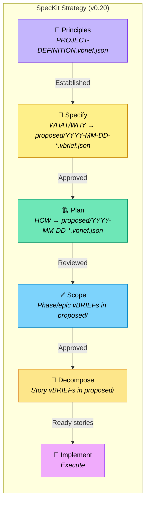

# SpecKit Strategy

A spec-driven development workflow inspired by [GitHub's spec-kit](https://github.com/github/spec-kit), with a Phase 4.5 readiness layer for decomposing broad implementation scopes into swarm-safe stories. Fully migrated to v0.20 (phases + stories emitted as date-prefixed vBRIEFs in proposed/; no legacy specification.vbrief.json).

**v0.20 note (s5-migrate-speckit-rapid-enterprise / #1166):** Speckit now emits only the canonical v0.20 shape (date-prefixed phase/epic + story vBRIEFs in proposed/, full PROJECT-DEFINITION.vbrief.json via task project:render or spec:render post, seeded lifecycle folders, no legacy specification.vbrief.json). Phase 4/4.5 scopes go to proposed/ (not pending/). See the dedicated ## v0.20 Output Shape section, the Artifacts Summary updated to the contract table, and the canonical contract `strategies/v0-20-contract.md` (s1-contract of #1166).

Legend (from RFC2119): !=MUST, ~=SHOULD, ≉=SHOULD NOT, ⊗=MUST NOT, ?=MAY.

**⚠️ See also**: [strategies/interview.md](./interview.md) | [strategies/discuss.md](./discuss.md) | [core/glossary.md](../core/glossary.md) | [strategies/v0-20-contract.md](./v0-20-contract.md) | [artifact-guards.md](./artifact-guards.md) | [vbrief/vbrief.md](../vbrief/vbrief.md)

## When to Use

- ~ Large or complex projects with multiple contributors
- ~ Projects requiring formal specification review
- ~ When parallel agent development is planned
- ~ Enterprise environments with compliance requirements
- ? Skip Phase 1 if PROJECT-DEFINITION.vbrief.json Principles narrative already defined

## Workflow Overview



(See ## v0.20 Output Shape for exact artifact rules, the mandatory `task project:render` / `task spec:render` post calls, and citation of strategies/v0-20-contract.md.)

---

## Phase 1: Principles

**Goal:** Establish immutable project principles before any specification.

**Output:** `Principles` narrative in `vbrief/PROJECT-DEFINITION.vbrief.json` (v0.20: plus any early proposed/ context vBRIEFs if needed)

! Before writing output artifacts, follow the guards in [artifact-guards.md](./artifact-guards.md) (Preparatory Guard for proposed/ items; Spec-Generating Guard for PROJECT-DEFINITION).

### Process

- ! Define 3-5 non-negotiable principles
- ! Include at least one anti-principle (⊗)
- ! Write principles as the `Principles` narrative in `vbrief/PROJECT-DEFINITION.vbrief.json`
- ~ Interview stakeholders about architectural constraints
- ⊗ Proceed without defined principles
- ⊗ Create a standalone `project.md` -- principles belong in PROJECT-DEFINITION.vbrief.json

### Transition Criteria

- ! `Principles` narrative in `vbrief/PROJECT-DEFINITION.vbrief.json` is complete
- ! All stakeholders have reviewed principles
- ~ No `[NEEDS CLARIFICATION]` markers remain

---

## Phase 2: Specify (WHAT/WHY)

**Goal:** Document WHAT to build and WHY, without implementation details.

**Output:** WHAT/WHY narratives in date-prefixed vBRIEF(s) in `vbrief/proposed/YYYY-MM-DD-*.vbrief.json` (v0.20; no singular specification.vbrief.json)

! Before writing output artifacts, follow the guards in [artifact-guards.md](./artifact-guards.md) (Preparatory Guard for proposed/ scope items; Spec-Generating Guard for PROJECT-DEFINITION).

Write the following narrative keys into the proposed/ vBRIEF `plan.narratives`

- `ProblemStatement` -- what problem this solves
- `Goals` -- desired outcomes
- `UserStories` -- user scenarios with priorities (P1, P2, P3) and acceptance scenarios (Given/When/Then)
- `Requirements` -- numbered functional (FR-001) and non-functional (NFR-001) requirements
- `SuccessMetrics` -- measurable success criteria (SC-001)
- `EdgeCases` -- boundary conditions and error handling

### Guidelines

- ! Focus on WHAT users need and WHY
- ! Use `[NEEDS CLARIFICATION: question]` for any ambiguity
- ! Number all requirements (FR-001, NFR-001) for traceability
- ! Prioritize user stories (P1, P2, P3)
- ⊗ Include HOW to implement (no tech stack, APIs, code)
- ⊗ Guess when uncertain -- mark it instead
- ⊗ Create `specs/` directories or standalone `spec.md` files -- all content goes in the proposed/ date-prefixed vBRIEF(s)

### Transition Criteria

- ! No `[NEEDS CLARIFICATION]` markers remain in narratives
- ! All user stories have acceptance scenarios
- ! Requirements are testable and unambiguous
- ! Stakeholders have approved specification narratives

---

## Phase 3: Plan (HOW)

**Goal:** Document HOW to build it with technical decisions.

**Input:** Approved WHAT/WHY narratives in the proposed/ date-prefixed vBRIEF(s) from Phase 2

**Output:** HOW narratives enriching the proposed/ vBRIEF(s) (v0.20; no singular specification.vbrief.json)

Add the following narrative keys to the proposed/ vBRIEF `plan.narratives`:

- `Architecture` -- high-level system design (components, data model, API contracts)
- `TechDecisions` -- technology choices with rationale
- `ImplementationPhases` -- phased delivery plan with dependencies
- `PreImplementationGates` -- simplicity gate, test-first gate

### Guidelines

- ! Reference spec requirements (FR-001, etc.) from Phase 2 narratives
- ! Document rationale for every technology choice
- ! Pass all pre-implementation gates before proceeding
- ⊗ Write implementation code
- ⊗ Create `specs/` directories or standalone `plan.md` files -- all content goes in the proposed/ date-prefixed vBRIEF(s)

### Post-Phase 3 Transition Gate: Render for Review

! Phase 3 -> Phase 4 is gated on an explicit render-and-review step, mirroring the Phase 2 approval gate. Complete the steps below **in order** before advancing. [skills/deft-directive-setup/SKILL.md](../skills/deft-directive-setup/SKILL.md) is required to invoke `task spec:render` at this boundary when running speckit interactively; the gate fails silently otherwise (yolo-mode agents used to skip it -- that is what this gate exists to prevent).

1. ! Run `task spec:render` (or `task project:render`) to (re-)produce derivative views from the proposed/ vBRIEFs + PROJECT-DEFINITION if needed for human review.
2. ! Confirm any rendered `SPECIFICATION.md` (if emitted as derivative) exists at the project root and contains the `<!-- deft:deprecated-redirect -->` sentinel.
3. ! The proposed/ vBRIEFs + PROJECT-DEFINITION are the source of truth. Derivatives are read-only exports.
4. ! Human reviewer approves (or requests changes). On approval, proceed to Phase 4.

### Transition Criteria

- ! All gates pass (or exceptions documented)
- ! Every spec requirement maps to a plan element
- ! Architecture reviewed and approved
- ! **Phase 3 -> Phase 4 transition criterion:** The proposed/ date-prefixed vBRIEF(s) + PROJECT-DEFINITION represent the approved spec (agents MUST NOT advance to Phase 4 without review of the v0.20 artifacts).

---

## Phase 4: Implementation Phase / Epic Scope Emission (v0.20)

**Goal:** Emit one broad scope vBRIEF per implementation phase or epic (plus stories via 4.5) so downstream tooling (`task roadmap:render`, `task project:render`, and Phase 4.5 decomposition) can operate against the lifecycle model described in [vbrief/vbrief.md](../vbrief/vbrief.md). All emitted to `proposed/` per v0.20 contract.

**Input:** Approved HOW narratives in the proposed/ date-prefixed vBRIEF(s) from Phase 3 (`ImplementationPhases` narrative describes IP-1..IP-N).

**Output:** N phase/epic scope vBRIEFs in `./vbrief/proposed/`, one per implementation phase or epic, using the filename convention `YYYY-MM-DD-ip<NNN>-<slug>.vbrief.json` (NNN = 3-digit zero-padded, 001..N). See [vbrief/vbrief.md — speckit Phase 4 scope vBRIEFs](../vbrief/vbrief.md#speckit-phase-4-scope-vbriefs) for the canonical convention. (v0.20: proposed/ not pending/.)

Phase 4 scopes are planning containers. They MAY keep broad acceptance in `plan.narratives.Acceptance` and MAY have `plan.items: []`. They are not valid concurrent swarm worker inputs unless explicitly marked as a single-story scope. Broad phase/epic scopes MUST pass through Phase 4.5 before swarm allocation.

### Scope vBRIEF Shape

For each implementation phase IP-N, write a scope vBRIEF with:

- ! `vBRIEFInfo.version` — current `scripts/_vbrief_build.py::EMITTED_VBRIEF_VERSION`
- ! `plan.title` — phase title (e.g. "IP-3: Implement data layer")
- ! `plan.status` — `pending` (or proposed per lifecycle)
- ! `plan.narratives.Description` — short human summary of the phase
- ! `plan.narratives.Acceptance` — acceptance criteria copied from the spec
- ! `plan.narratives.Traces` — FR/NFR/IP IDs the phase covers (e.g. `FR-001, FR-003, NFR-002, IP-3`)
- ! `plan.references` — link back to the parent proposed/ vBRIEF from Phase 3 (`type: x-vbrief/plan`, `TrustLevel: internal`)
- ! `plan.metadata.kind` — `phase` or `epic`
- ! `plan.metadata.dependencies` — array of IP IDs this phase depends on / is blocked by (plan-level; mirrors the `edges[].blocks` structure used in earlier drafts)

```json
{
  "vBRIEFInfo": { "version": "<EMITTED_VBRIEF_VERSION>" },
  "plan": {
    "title": "IP-3: Implement data layer",
    "status": "pending",
    "narratives": {
      "Description": "Stand up the data layer described in the Phase 3 proposed/ vBRIEF Architecture.",
      "Acceptance": "Repository interfaces defined; CRUD round-trips pass integration tests.",
      "Traces": "FR-001, FR-003, NFR-002, IP-3"
    },
    "metadata": {
      "kind": "phase",
      "dependencies": ["ip-1", "ip-2"]
    },
    "references": [
      { "type": "x-vbrief/plan", "uri": "2026-05-26-ip002-plan.vbrief.json", "TrustLevel": "internal" }
    ],
    "items": []
  }
}
```

### plan.vbrief.json — Session Tracker Only

- ! `plan.vbrief.json` reverts to its canonical session-todo role defined in [vbrief/vbrief.md — plan.vbrief.json](../vbrief/vbrief.md#planvbriefjson). It is the agent-private tactical plan for the current session, not the project-wide IP list.
- ! While working on a specific scope vBRIEF, `plan.vbrief.json` MUST carry a `planRef` to that scope vBRIEF in `vbrief/proposed/` or `vbrief/active/`.
- ⊗ Emit the project-wide Phase 4 task list to `plan.vbrief.json` — write per-IP scope vBRIEFs to `vbrief/proposed/` instead.

### Migrating Legacy speckit Projects

- ~ Projects that already emitted a speckit-shaped `plan.vbrief.json` (project-wide IP list) can convert to the new model with:
  ```
  python scripts/migrate_vbrief.py --speckit-plan vbrief/plan.vbrief.json
  ```
  The translator emits one scope vBRIEF per IP into `vbrief/proposed/` (3-digit padded filenames, bilingual `edges` reader so both `from/to` and legacy `source/target` translate correctly) and writes the remaining session-level scaffold back to `plan.vbrief.json`.

### Guidelines

- ! Derive one scope vBRIEF per implementation phase from `ImplementationPhases`
- ! Populate `Description`, `Acceptance`, and `Traces` narratives per [vbrief/vbrief.md — canonical narrative keys](../vbrief/vbrief.md#scope-vbrief-narrative-keys)
- ! Use `plan.metadata.dependencies` (plan-level) rather than item-level `blocks` edges for cross-scope dependencies
- ! Use `plan.metadata.kind = "phase"` or `"epic"` for broad implementation scopes
- ~ Size each phase for 1-4 hours of work so the swarm allocator can distribute cleanly
- ⊗ Create phases not traceable to a spec requirement
- ⊗ Allocate Phase 4 phase/epic scope vBRIEFs directly to concurrent swarm workers

### Transition Criteria

- ! Every implementation phase from `ImplementationPhases` has a matching scope vBRIEF in `./vbrief/proposed/`
- ! Each scope vBRIEF has `Description`, `Acceptance`, and `Traces` narratives
- ! Each scope vBRIEF carries a `references` entry linking back to the parent Phase 3 proposed/ vBRIEF with `TrustLevel: internal`
- ! Cross-scope dependencies in `plan.metadata.dependencies` form a valid DAG (no cycles)

---

## Phase 4.5: Story Decomposition / Swarm Readiness

**Goal:** Convert approved Phase 4 phase/epic scopes into child story vBRIEFs suitable for parallel agents.

**Input:** Phase 4 phase/epic vBRIEFs in `./vbrief/pending/` or `./vbrief/active/`.

**Output:** Story-level child vBRIEFs whose executable acceptance criteria live in `plan.items` and whose `plan.metadata.swarm` contract proves they are safe to allocate.

### Process

1. ! Inspect approved specification narratives and Phase 4 scope vBRIEFs.
2. ! Identify `plan.metadata.kind = "phase"` or `"epic"` scopes that are too broad for direct implementation.
3. ! Draft a deterministic decomposition proposal: stories, dependencies, expected file scope, verification commands, traces, and conflict groups.
4. ! Store the temporary proposal artifact under `vbrief/.eval/decompositions/<parent-slug>.json`; derive `<parent-slug>` from the parent vBRIEF filename by removing `.vbrief.json` and any leading `YYYY-MM-DD-` date prefix.
5. ! Ask for explicit user approval before writing child story vBRIEFs.
6. ! Validate the approved draft with `task scope:decompose -- <parent.vbrief.json> --draft vbrief/.eval/decompositions/<parent-slug>.json --check`, then apply it without `--check`.
7. ! Run `task swarm:readiness -- vbrief/active/*.vbrief.json` before concurrent allocation, or point it at the candidate child story files for a dry readiness review before activation.

### Story vBRIEF Requirements

Each Phase 4.5 child story vBRIEF MUST include:

- ! `plan.metadata.kind = "story"`
- ! non-empty `plan.items`
- ! `plan.narratives.Description` with at least two concrete sentences
- ! `plan.narratives.ImplementationPlan` with at least two concrete implementation steps
- ! executable acceptance in each story's `plan.items`
- ! `plan.narratives.UserStory` in the form `As a <role>, I want <capability>, so that <outcome>.`
- ! 2-5 concrete, observable acceptance criteria unless explicitly justified
- ! explicit dependencies in `plan.metadata.swarm.depends_on`
- ! traceability back to requirements via `Traces` narratives or explicit trace justification
- ! expected file scope in `plan.metadata.swarm.file_scope`
- ! verify commands in `plan.metadata.swarm.verify_commands`
- ! expected outputs/evidence in `plan.metadata.swarm.expected_outputs`
- ! swarm readiness metadata in `plan.metadata.swarm`
- ! `planRef` pointing to the parent phase/epic scope
- ! parent phase/epic `references` updated to point to every child story

### Decomposition Command

Use the deterministic command surface:

```bash
task scope:decompose -- vbrief/pending/2026-05-12-ip001-auth.vbrief.json --draft vbrief/.eval/decompositions/ip001-auth.json --check
task scope:decompose -- vbrief/pending/2026-05-12-ip001-auth.vbrief.json --draft vbrief/.eval/decompositions/ip001-auth.json
task scope:decompose -- --check
```

The draft JSON is a temporary proposal artifact, not a vBRIEF. Agents SHOULD write draft proposals under `vbrief/.eval/decompositions/`, which is gitignored specifically for local decomposition scratch. Derive `<parent-slug>` from the parent vBRIEF filename by removing `.vbrief.json` and any leading `YYYY-MM-DD-` date prefix. Agents MUST NOT leave decomposition draft JSON files at the workspace root. The command validates and applies a proposed decomposition rather than freely inventing one. It creates generated child story vBRIEFs as lifecycle artifacts, defaulting to `vbrief/pending/`, preserves origin/provenance references, sets each child `planRef` to the parent scope, updates parent references to include children, validates the dependency DAG, rejects dependency cycles, and rejects ready stories missing user-story shape, concrete observable acceptance, narrow file scope, focused verify commands, or traces. Parent `plan.items` are input signals, not automatic child stories.

Parent phase/epic acceptance MAY remain in `plan.narratives.Acceptance` as context. Executable acceptance for swarm work MUST be redistributed into child story `plan.items`.

### Swarm Readiness Command

Use the readiness gate before swarm allocation:

```bash
task swarm:readiness -- vbrief/active/*.vbrief.json
```

The readiness report lists ready stories, blocked stories, decomposition-needed epics/phases, dependency waves, conflict groups, a file-overlap matrix, and missing fields. It exits non-zero when candidate work is not swarm-ready for concurrent allocation. `readiness=ready` means ready for concurrent allocation; sequential-safe or low-confidence work MUST use another state such as `sequential` or `needs_refinement` and will fail this gate until refined or scheduled outside concurrent swarm allocation.

### Transition Criteria

- ! Candidate swarm work consists only of `kind=story` vBRIEFs
- ! Every candidate story has non-empty `plan.items`
- ! Every candidate story has a product-shaped `UserStory`, 2-5 observable acceptance criteria unless justified, file scope, verify commands, traces or trace justification, and readiness metadata.
- ! Dependencies resolve and form a DAG
- ! No unsafe file-scope overlap exists among parallel stories
- ! No `size=large` story is marked `parallel_safe=true`
- ! No ready story uses broad file globs, only generic verification such as `task check`, `parallel_safe=false`, or `file_scope_confidence=low`

---

## Phase 5: Implement

**Goal:** Execute scope vBRIEFs following test-first discipline.

**Input:** Story-level scope vBRIEFs in `./vbrief/pending/` (promote to `./vbrief/active/` via `task scope:activate` when work begins). `./vbrief/plan.vbrief.json` holds the current session's tactical todo list and carries a `planRef` to the active scope. Concurrent swarm implementation requires Phase 4.5-ready stories.

### Process

- ! Write tests BEFORE implementation (Red)
- ! Implement minimal code to pass tests (Green)
- ! Refactor while keeping tests green (Refactor)
- ! Update scope vBRIEF `plan.status` and folder via `task scope:*` commands as work progresses (`pending` → `running` → `completed`)
- ! Update `./vbrief/plan.vbrief.json` session todos as tactical steps progress (session-scoped; do NOT put the project-wide IP list here)
- ~ Work on story vBRIEFs whose `plan.metadata.swarm.depends_on` entries are already completed in parallel when possible

### File Creation Order

1. Create contract/API specifications
2. Create test files (contract → integration → unit)
3. Create source files to make tests pass
4. Refactor and document

### Guidelines

- ! Follow the `Principles` narrative in `vbrief/PROJECT-DEFINITION.vbrief.json` throughout
- ! Move scope vBRIEFs through lifecycle folders using `task scope:activate|complete|cancel|block|unblock`
- ⊗ Implement without failing tests first
- ⊗ Skip refactoring phase
- ⊗ Write the project-wide IP list to `plan.vbrief.json` — use `vbrief/pending/` scope vBRIEFs as the durable task tracker
- ⊗ Allocate broad `kind=epic` or `kind=phase` scopes to concurrent swarm workers before decomposition

---

## Artifacts Summary (pre-v0.20, for reference only during migration)

| Phase | Artifact | Purpose |
|-------|----------|---------|
| 1. Principles | `vbrief/PROJECT-DEFINITION.vbrief.json` | Governing rules (Principles narrative) |
| 2. Specify | date-prefixed in `vbrief/proposed/` | WHAT/WHY narratives (v0.20) |
| 3. Plan | date-prefixed in `vbrief/proposed/` | HOW narratives (enriches Phase 2; v0.20) |
| 3b. Render (derivative) | `SPECIFICATION.md` (via `task spec:render`, sentinel only) | Read-only human review export (optional) |
| 3c. Render PRD (derivative) | `PRD.md` (via `task prd:render`, sentinel only) | Optional stakeholder-review export |
| 4. Tasks | `./vbrief/proposed/YYYY-MM-DD-ip<NNN>-<slug>.vbrief.json` (one per IP/epic) | Phase/epic scope vBRIEFs (v0.20: proposed/) drive roadmap/project render + decomposition |
| 4.5. Story decomposition | Child story vBRIEFs with `plan.metadata.swarm` in proposed/ | Swarm-ready executable units (v0.20) |
| 4b. Session todos | `./vbrief/plan.vbrief.json` | Session-level tactical plan (carries `planRef` to active scope) |
| 5. Implement | Code + tests | Working software, optionally via swarm |

## Directory Structure (v0.20)

```
project/
├── vbrief/
│   ├── PROJECT-DEFINITION.vbrief.json  # Phase 1: Principles narrative
│   ├── proposed/                       # Phase 2+: date-prefixed WHAT/WHY/HOW + IP scopes + stories
│   │   └── YYYY-MM-DD-*.vbrief.json
│   │   └── YYYY-MM-DD-ip001-....vbrief.json
│   ├── plan.vbrief.json                # Phase 4b: session todos (planRef to active scope)
│   └── pending/ active/ etc.           # Lifecycle (seeded empty or with promoted)
├── SPECIFICATION.md                    # Optional derivative (task spec:render; sentinel only)
├── PRD.md                              # Optional derivative (task prd:render; sentinel only)
└── src/                                # Phase 5
```

(See ## v0.20 Output Shape and `strategies/v0-20-contract.md` for the authoritative table row for speckit.)

---

## v0.20 Output Shape (s5-migrate-speckit-rapid-enterprise / #1166)

This strategy has been migrated to the full v0.20 output shape so speckit-generated projects are accepted by the build skill Pre-Cutover Detection Guard with zero errors on first attempt (resolves the speckit row from the #1166 inconsistency table and the s5 story acceptance criteria, including story-level vBRIEFs in proposed/ instead of only phase/epic in pending/).

- ! Seed the five lifecycle folders under `vbrief/` if any are missing: `proposed/`, `pending/`, `active/`, `completed/`, `cancelled/`.
- ! Emit all scope items (principles context, spec phases/stories, implementation phases/epics) exclusively as date-prefixed scope vBRIEFs in `vbrief/proposed/YYYY-MM-DD-<kebab-slug>.vbrief.json` (or the ipNNN convention for phases per vbrief.md). For speckit, phases use `YYYY-MM-DD-ip<NNN>-<slug>.vbrief.json` in proposed/; stories from Phase 4.5 also in proposed/. Decompose plans into focused, buildable vBRIEFs (v0.6 schema) rather than a monolithic legacy spec.
- ! After the proposed/ vBRIEFs are written (or at Phase 3/4 boundaries), invoke `task project:render` (or `task spec:render` post) from the repo root to generate/refresh the complete `vbrief/PROJECT-DEFINITION.vbrief.json` (items registry derived from the lifecycle folders).
- ⊗ Never emit `vbrief/specification.vbrief.json` (or any legacy dual-write).
- ~ `SPECIFICATION.md` / `PRD.md` at the project root, if produced at all, must be only read-only derivatives that include the v0.20 deprecated-redirect sentinel. The source of truth is the vbrief/ lifecycle (proposed/ phases + stories) + PROJECT-DEFINITION.
- ! Before writing any proposed/ vBRIEFs or PROJECT-DEFINITION, follow the guards in [artifact-guards.md](./artifact-guards.md) (Preparatory Guard for scope items in proposed/; Spec-Generating Guard for PROJECT-DEFINITION).
- ! Final output tree must pass the deterministic v0.20 strategy output validation gate (s2-deterministic-gate) and the build Pre-Cutover Detection Guard with zero warnings/errors. See full acceptance in the s5 vBRIEF (a1: date-prefixed stories in proposed/ + deterministic gate; a2: speckit story-level in proposed/ not only pending phases; a3: no legacy specification.vbrief.json) and the 1166 decomposition.
- ! Cite the canonical contract `strategies/v0-20-contract.md` (s1-contract) for the exact shape and the per-strategy table row (speckit: Yes lifecycle; Yes PROJECT-DEFINITION Phase 1+; proposed/ (phases + stories date-prefixed); Never specification.vbrief.json; Omit (use task spec:render post) for SPEC/PRD).

---

## Artifacts Summary (v0.20)

**Speckit (full 5-phase with Phase 4/4.5):**

| Artifact | Purpose | Created By |
|----------|---------|------------|
| `vbrief/PROJECT-DEFINITION.vbrief.json` | Principles + full items registry | Speckit Phase 1 + `task project:render` |
| `vbrief/proposed/YYYY-MM-DD-*.vbrief.json` + `YYYY-MM-DD-ipNNN-*.vbrief.json` | All spec (WHAT/WHY/HOW) + phases/epics/stories (date-prefixed; per v0.20 contract and vbrief.md speckit convention) | Speckit Phases 2-4.5 |
| `vbrief/{proposed,pending,active,completed,cancelled}/` | All five lifecycle folders seeded | Speckit |
| (optional derivative) `SPECIFICATION.md` / `PRD.md` | Human-readable (includes deprecated-redirect sentinel only) | `task spec:render` / `task prd:render` (post) |
| `vbrief/plan.vbrief.json` | Session-level tactical plan (planRef to active) | Speckit (internal) |

**Pre-v0.20 / legacy artifacts that MUST NOT be produced by this strategy:**

- `vbrief/specification.vbrief.json`
- Primary handoff `SPECIFICATION.md` or `PRD.md` at project root (without sentinel)
- Phase/epic scopes in `pending/` (use `proposed/`)

See the full table and rules in `strategies/v0-20-contract.md` (speckit row reproduced above).

---

## Invoking This Strategy

Set in PROJECT-DEFINITION.vbrief.json narratives:
```json
"Strategy": "strategies/speckit.md"
```

Or explicitly:
```
Use the speckit strategy for this project.
```

Start with:
```
I want to build [project] with features:
1. [feature]
2. [feature]
```
