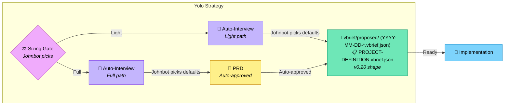

# Yolo Strategy

Auto-pilot interview: the agent plays both sides, always picking the recommended
option. Same workflow as [interview.md](./interview.md) (including the sizing
gate) but the agent answers its own questions via "Johnbot."

**v0.20 note (s3-migrate-yolo / #1166):** Yolo now emits only the canonical v0.20 shape (date-prefixed story vBRIEFs in proposed/, full PROJECT-DEFINITION.vbrief.json via task project:render, seeded lifecycle folders, no legacy specification.vbrief.json). See the dedicated ## v0.20 Output Shape section.

Legend (from RFC2119): !=MUST, ~=SHOULD, ≉=SHOULD NOT, ⊗=MUST NOT, ?=MAY.

**⚠️ See also**: [strategies/interview.md](./interview.md) | [strategies/discuss.md](./discuss.md) | [core/glossary.md](../core/glossary.md) | [vbrief/vbrief.md](../vbrief/vbrief.md) | [artifact-guards.md](./artifact-guards.md)

---

## When to Use

- ~ Quick prototyping where speed matters more than precision
- ~ When the user trusts the agent's recommended defaults
- ? When exploring an idea before committing to a full interview
- ⊗ Production systems or compliance-heavy projects — use [interview.md](./interview.md) instead

## Chaining Gate

Johnbot auto-selects at the [chaining gate](./interview.md#chaining-gate) too.

- ! Johnbot MUST select **"Proceed to specification"** (option 1) — no preparatory detours
- ! Johnbot MUST select **"Accept"** at the [acceptance gate](./interview.md#acceptance-gate) — no revisions
- ⊗ Ask the real user to choose at either gate — Johnbot handles both automatically

## Sizing Gate

Johnbot picks the size too. The same sizing signals from
[interview.md](./interview.md#sizing-gate) apply, but Johnbot makes the call
without asking the user.

- ! Check `PROJECT.md` for `**Process**: Light` or `**Process**: Full` — if declared, use that path
- ! If not declared, Johnbot picks based on feature count and complexity signals
- ~ Default to Light for typical yolo projects (speed over ceremony)

## Workflow Overview



(See ## v0.20 Output Shape for exact artifact rules and the mandatory `task project:render` call.)

---

## Interview Rules

Same as [interview.md](./interview.md#interview-rules-shared-by-both-paths),
with Johnbot additions:

- ~ Use Claude AskInterviewQuestion when available (emulate if not)
- ! Ask **ONE** focused, non-trivial question per step
- ⊗ Ask multiple questions at once or sneak in "also" questions
- ~ Provide numbered answer options when appropriate
- ! Include "other" option for custom/unknown responses
- ! Indicate which option is RECOMMENDED
- ! Pretend you are the user "Johnbot" too
- ~ Johnbot asks for details/clarifications on the questions when appropriate
- ! Johnbot ultimately goes with the RECOMMENDED option
- ⊗ Ask the real user to answer a question — keep working with Johnbot until you can build the specification

---

## Light Path

Same as [interview.md Light path](./interview.md#light-path-smallmedium-projects)
but Johnbot answers all questions and auto-approves.

---

## Full Path

Same as [interview.md Full path](./interview.md#full-path-largecomplex-projects)
but Johnbot answers all questions and auto-approves the PRD.

---

## v0.20 Output Shape (s3-migrate-yolo / #1166)

This strategy has been migrated to the full v0.20 output shape so yolo-generated projects are accepted by the build skill Pre-Cutover Detection Guard with zero errors on first attempt (resolves the yolo row from the #1166 inconsistency table).

- ! Seed the five lifecycle folders under `vbrief/` if any are missing: `proposed/`, `pending/`, `active/`, `completed/`, `cancelled/`.
- ! Emit story scope items exclusively as date-prefixed scope vBRIEFs: `vbrief/proposed/YYYY-MM-DD-<kebab-slug>.vbrief.json` (use the run's creation date for the prefix; choose descriptive slugs). Decompose the yolo plan into one or more focused, buildable story vBRIEFs (v0.6 schema) rather than a monolithic legacy spec.
- ! After the proposed/ stories are written, invoke `task project:render` (run from the repo root) to generate/refresh the complete `vbrief/PROJECT-DEFINITION.vbrief.json` (items registry is derived from the lifecycle folders).
- ⊗ Never emit `vbrief/specification.vbrief.json` (or any legacy dual-write).
- ~ `SPECIFICATION.md` at the project root, if produced at all, must be only a read-only derivative (e.g. via `task spec:render` after the vbriefs exist) that includes the v0.20 deprecated-redirect sentinel. The source of truth is the vbrief/ lifecycle stories + PROJECT-DEFINITION.
- ! Before writing any proposed/ stories or PROJECT-DEFINITION, follow the guards in [artifact-guards.md](./artifact-guards.md) (Preparatory Guard for scope items in proposed/; Spec-Generating Guard for PROJECT-DEFINITION).
- ! Final output tree must pass the deterministic v0.20 strategy output validation gate (s2-deterministic-gate) and the build Pre-Cutover Detection Guard with zero warnings/errors. See full acceptance in the yolo migration vBRIEF and the 1166 decomposition.
- ~ Once available, cite the canonical contract `strategies/v0-20-contract.md` (s1-contract) for the exact shape.

---

## SPECIFICATION Guidelines

Yolo expresses "specification" work via the v0.20 date-prefixed story vBRIEFs emitted to `vbrief/proposed/` (see v0.20 Output Shape section above).

The detailed guidelines from [interview.md](./interview.md#specification-guidelines-both-paths) for content quality, requirements IDs, phasing, parallelism, test-first, task sizing, and format still apply — but the *delivery mechanism* is the discrete vBRIEF stories + PROJECT-DEFINITION (never the legacy specification.vbrief.json).

---

## Artifacts Summary (v0.20)

**Light path and Full path (identical under yolo; PRD auto-approved on Full):**

| Artifact | Purpose | Created By |
|----------|---------|------------|
| `vbrief/proposed/YYYY-MM-DD-*.vbrief.json` (one or more) | Focused story scope items (date-prefixed per vbrief convention) | Yolo (Johnbot) |
| `vbrief/PROJECT-DEFINITION.vbrief.json` | Project identity gestalt + complete scope items registry | `task project:render` (invoked by Yolo) |
| `vbrief/{proposed,pending,active,completed,cancelled}/` | All five lifecycle folders seeded | Yolo |
| (optional derivative) `SPECIFICATION.md` | Human-readable plan (includes deprecated-redirect sentinel) | `task spec:render` (if invoked) |

**Pre-v0.20 / legacy artifacts that MUST NOT be produced by this strategy:**

- `vbrief/specification.vbrief.json`
- Primary handoff `SPECIFICATION.md` at project root

---

## Invoking This Strategy

```
/deft:run:yolo [project name]
```

Or explicitly:

```
Use the yolo strategy to plan [project].
```

After completion (v0.20 shape):

```
task project:render
# Review date-prefixed stories in vbrief/proposed/ + the generated PROJECT-DEFINITION.vbrief.json
# Implement per the v0.20 artifacts (build skill accepts cleanly on first try)
```
